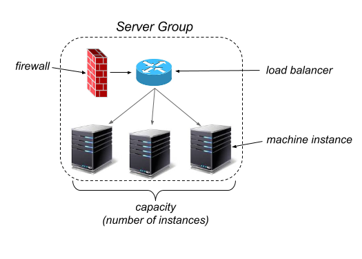

Spinnaker Deployment
====================

###OVERVIEW

Spinnaker is used as a continuous delivery platform for releasing software changes. The continuous delivery process begins with the creation of a deployable asset (such as a machine image, a JAR file, .deb file or a Docker image) and ends with a deployment to the cloud.

Spinnaker provides two sets of features:

* Cluster management, to configure, delete, disable, and deploy cloud resources like server groups, security groups, and load balancers, using strategies like blue/green deployments.

* Deployment management, to create and manage continuous delivery workflows called pipelines.

Pipelines are configurable, reusable processes that can be triggered by the completion of a Jenkins job, by a CRON expression, or even by another pipeline. Pipelines consist of stages, which are operations or phases in the continuous delivery process. Spinnaker comes with a number of stages, such as baking a machine image, deploying an image, running a Jenkins job, or waiting for user approval. Pipeline stages can be run in parallel or serially.

###CLUSTER MANAGEMENT

Spinnaker&#39;s cluster management features are used to manage resources in the cloud.

- **Server Group** : The base resource to be managed is the Server Group. A Server Group identifies the machine instance profile on which to execute images along with the number of instances, and is associated with a Load Balancer and a Security Group. A Server Group is also identified with basic configuration settings, such as user account information and the region/zone in which images are deployed. When deployed, a Server Group is a collection of virtual machines running software.

- **Security Group** : A Security Group defines network traffic access. It is effectively a set of firewall rules defined by an IP range (CIDR) along with a communication protocol (e.g., TCP) and port range.
- **Load Balancer** : A Load Balancer is associated with an ingress protocol and port range, and balances traffic among instances in the corresponding Server Group. Optionally, you can enable health checks for a load balancer, with flexibility to define health criteria and specify the health check endpoint.
- **Cluster** : A Cluster is a user-defined, logical grouping of Server Groups in Spinnaker.

###DEPLOYMENT MANAGEMENT

Spinnaker&#39;s deployment management features are used to construct and manage continuous delivery workflows.

- **Pipeline** : Pipelines are the key deployment management construct in Spinnaker. They are defined by a sequence of stages, along with automated triggers (optional) that kick off the pipeline, parameters that get passed to all stages in the pipeline, and can be configured to issue notifications as the pipeline executes.

Automatic triggers can be a Jenkins job, a CRON schedule, or another pipeline. You can also manually start a pipeline. Notifications can be sent out to email, SMS or HipChat on pipeline start/complete/fail.

####Fig 1. Deployment Management with Spinnaker

###ARCHETECTURE

Deploying this Quick Start with the default parameters builds the following Spinnaker environment in the AWS Cloud.

####Figure 2: Architecture for Spinnaker on AWS

###Amazon Web Services Setup

If you&#39;d like to have Spinnaker deploy to and manage clusters on AWS, you&#39;ll need to have an AWS project set up. If you&#39;ve already got one, please skip to the next step. Otherwise, please follow the

instructions below.

Keep in mind that naming of your entities in AWS is important as Spinnaker will use them to populate available resource lists in the Spinnaker UI.

Sign into the AWS console and let AWS pick a default region where your project resources will be allocated. In the rest of this tutorial, we&#39;ll assume that the region

assigned is us-west-2. If the region selected for your project is different from this, please substitute your region everywhere us-west-2 appears below.

Also, in the instructions below, we&#39;ll assume that your AWS account name is my-aws-account. Wherever you see my-aws-account appear below, please replace it with your AWS account name.

1. Create VPC.
  - Goto  [Console](https://console.aws.amazon.com/) &gt; VPC.
  - Click on Start VPC Wizard.
  - On the Step 1: Select a VPC Configuration screen, make sure that VPC with a Single Public Subnet is highlighted and click Select.
  - Name your VPC. Enter defaultvpc in the VPC name field.
  - Enter defaultvpc.internal.us-west-2 for Subnet name.
  - Click Create VPC.

1. Create an EC2 role.
  - Goto  [Console](https://console.aws.amazon.com/) &gt; AWS Identity &amp; Access Management &gt; Roles.
  - Click Create New Role.
  - Set Role Name to BaseIAMRole. Click Next Step.
  - On Select Role Type screen, hit Select for Amazon EC2.
  - Click Next Step.
  - On Review screen, click Create Role.
  - EC2 instances launched with Spinnaker will be associated with this role.

1. Create an EC2 Key Pair for connecting to your instances.
  - Goto  [Console](https://console.aws.amazon.com/) &gt; EC2 &gt; Key Pairs.
  - Click Create Key Pair.
  - Name the key pair my-aws-account-keypair. (Note: this must match your account name plus &quot;-keypair&quot;)
  - AWS will download file my-aws-account-keypair.pem to your computer. chmod 400 the file.

1. Create AWS credentials for Spinnaker.
  - Goto  [Console](https://console.aws.amazon.com/) &gt; AWS Identity &amp; Access Management &gt; Users &gt; Create New Users. Enter a username and hit Create.
  - Create an access key for the user. Click Download Credentials,
then Save the access key and secret key into
~/.aws/credentials on your machine as shown
 [here](https://docs.aws.amazon.com/cli/latest/userguide/cli-chap-getting-started.html#cli-config-files).
  - Click Close.
  - Click on the username you entered for a more detailed screen.
  - On the Summary page, click on the Permissions tab.
  - Click Attach Policy.
  - Click the checkbox next to PowerUserAccess, then click Attach Policy.
  - Click on the Inline Policies header, then click the link to create an inline policy.
  - Click Select for Policy Generator.
  - Select AWS Identity and Access Management from the AWS Service pulldown.
  - Select PassRole for Actions.
  - Type (the asterisk character) in the \*Amazon Resource Name (ARN) box.
  - Click Add Statement, then Next Step.
  - Click Apply Policy.

**Deploying Spinnaker**

Once you&#39;ve setup your Cloud provider environment you are ready to install and run Spinnaker. Your choice of where to run Spinnaker does not affect your choice of deployment targets, but some of the hosted turn-key solutions are preconfigured to deploy to a limited set of platforms.

## SPINNAKER COMPONENTS

**image

Spinnaker can be deployed on any target environment, and can manage infrastructure in any of the supported cloud providers. For instance, you can deploy your Spinnaker cluster to Google Cloud Platform, but manage infrastructure on Amazon Web Services and Kubernetes. Next, we&#39;ll step through the configuration for each of the supported target environments.

Create an AWS virtual machine.

1. Goto  [AWS Console](https://console.aws.amazon.com/) &gt; AWS Identity &amp; Access
Management &gt; Roles.
  - Click on Create New Role.
  - Type &quot;spinnakerRole&quot; in the Role Name field. Hit Next Step.
  - Click Select for the Amazon EC2 service.
  - Select the checkbox next to PowerUserAccess, then click
Next Step, followed by Create Role.
  - Click on the role you created.
  - Click on the Inline Policies header, then click the link to create an inline policy.
  - Click Select for Policy Generator.
  - Select AWS Identity and Access Management from the AWS Service pulldown.
  - Select PassRole for Actions.
  - Type (the asterisk character) in the \*Amazon Resource Name (ARN) box.
  - Click Add Statement, then Next Step.
  - Click Apply Policy.
  - Go to  [AWS Console](https://console.aws.amazon.com/) &gt; EC2.
  - Click Launch Instance.
  - Click Community AMIs then
  - If the default region where your resources were allocated in  [Step 1](http://www.spinnaker.io/docs/creating-a-spinnaker-instance#step-1-set-up-your-target-deployment-environment) is us-west-2, click Select for the spinnaker\_jenkins ami-5632fb36 image.
  - Under Step 2: Choose an Instance Type, click the radio button
for m4.xlarge, then click Next: Configure Instance Details.
  - Set the Auto-assign Public IP field to Enable, and the IAM
role to &quot;spinnakerRole&quot;.
  - Click Review and Launch.
  - Click Launch.

Once the instance is launched Access spinnaker using Route53 Domain name.

https://&lt;domainname&gt;

[https://builddeploy.modeler.gy/](https://builddeploy.modeler.gy/)

Credentials: logikoma / password
